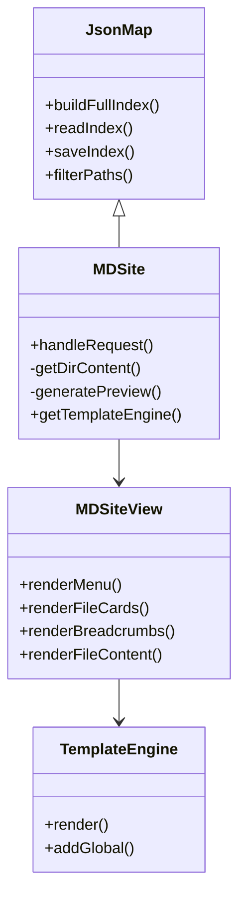

### Концепция системы с классами MDSite (модель) и MDSiteView (представление)

#### 1. Архитектурная схема



#### 2. Класс MDSiteView (подготовка данных для представления)

**Ответственность**:
- Формирование структурированных данных для разных компонентов UI
- Подготовка данных для шаблонов
- Генерация URL-адресов для навигации

**Основные методы**:

```php
class MDSiteView {
    private $dataBuilder;
    
    public function __construct(MDSite $site) {
        $this->dataBuilder = $site;
    }
    
    /**
     * Данные для карточек файлов/папок
     */
    public function getCardData(string $dir): array {
        return [
            'type' => 'directory', // или 'file'
            'title' => basename($dir),
            'preview' => $this->getPreview($dir),
            'url_view' => "?dir={$dir}",
            'url_content' => "?dir={$dir}&file=content"
        ];
    }
    
    /**
     * Древовидное меню на основе index.json
     */
    public function getTreeMenuData(): array {
        $items = [];
        foreach ($this->dataBuilder->getFullIndex() as $path) {
            $parts = explode('/', trim($path, '/'));
            $this->buildMenuLevel($items, $parts);
        }
        return $items;
    }
    
    /**
     * Хлебные крошки для навигации
     */
    public function getBreadcrumbs(string $currentPath): array {
        $crumbs = [];
        $parts = explode('/', $currentPath);
        $accumulated = '';
        
        foreach ($parts as $part) {
            $accumulated .= $part.'/';
            $crumbs[] = [
                'title' => $part,
                'url' => '?dir='.trim($accumulated, '/')
            ];
        }
        
        return $crumbs;
    }
}
```

#### 3. Интеграция с MDSite

```php
class MDSite extends JsonMap {
    // ... существующие методы ...
    
    public function render(string $template, array $viewData = []) {
        $engine = $this->getTemplateEngine();
        $view = new MDSiteView($this);
        
        $data = [
            'menu' => $view->getTreeMenuData(),
            'content' => $viewData
        ];
        
        return $engine->render($template, $data);
    }
}
```

#### 4. Пример использования

**Генерация страницы с карточками**:
```php
$site = new MDSite();
$dir = $_GET['dir'] ?? '';

if ($dir) {
    $content = $site->render('cards', [
        'cards' => array_map(
            fn($path) => $site->getView()->getCardData($path),
            $site->getDirContent($dir)
        ),
        'breadcrumbs' => $site->getView()->getBreadcrumbs($dir)
    ]);
}

echo $content;
```

#### 5. Шаблоны (пример для Twig)

**cards.twig**:
```twig
<div class="breadcrumbs">
    
        <a href="{{ crumb.url }}">{{ crumb.title }}</a>
         / 
    
</div>

<div class="card-grid">
    
        <div class="card card-{{ card.type }}">
            <h3>{{ card.title }}</h3>
            <div class="preview">{{ card.preview|raw }}</div>
            <a href="{{ card.url_view }}" class="btn">Открыть</a>
            
                <a href="{{ card.url_content }}" class="btn">Читать</a>
            
        </div>
    
</div>
```

#### 6. Генерация URL-адресов

Модифицированный метод в MDSiteView:
```php
public function generateUrl(string $type, string $path): string {
    $base = "?dir=".urlencode(dirname($path));
    
    return match($type) {
        'view' => $base,
        'content' => $base."&file=".urlencode(basename($path)),
        'download' => $base."&download=".urlencode(basename($path))
    };
}
```

#### 7. Что это дает?

1. **Гибкость представления**:
   - Можно легко менять HTML-шаблоны
   - Поддержка разных шаблонизаторов

2. **Тестируемость**:
   - Данные для представления можно тестировать отдельно
   - Шаблоны можно менять без изменения логики

3. **Масштабируемость**:
   - Легко добавить новые компоненты (например, поиск)
   - Поддержка разных типов отображения (карточки, таблица)

4. **Безопасность**:
   - Все URL генерируются автоматически с экранированием
   - Данные для шаблонов проходят предварительную подготовку

Такой подход соответствует принципам MVC и обеспечивает четкое разделение ответственности между компонентами системы.
