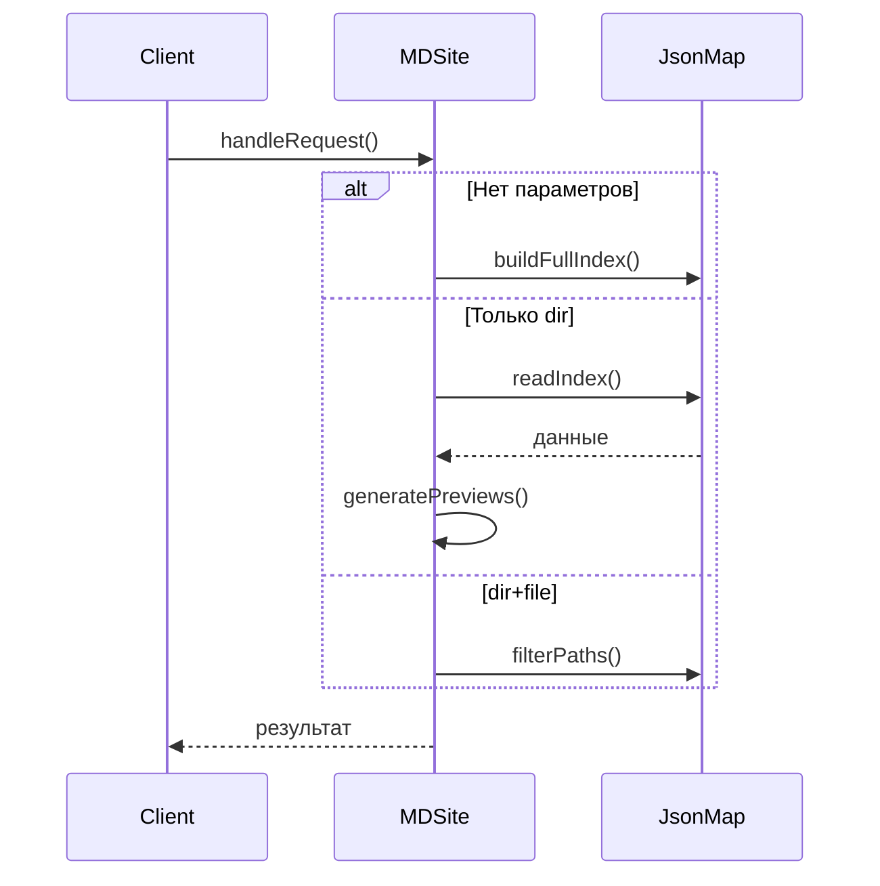

### Уточненная концепция системы: разделение на классы

#### 1. Класс `JsonMap` (низкоуровневый обработчик JSON-структур)

**Ответственность**:
- Работа с файловой системой (чтение/запись JSON)
- Базовые операции с массивами путей
- Валидация данных

**Методы**:
```php
class JsonMap {
    // Конструктор с настройками
    public function __construct(string $baseDir) {...}
    
    // Создает/обновляет основной индекс
    public function buildFullIndex(): array {...}
    
    // Читает существующий индекс
    public function readIndex(string $name): array {...}
    
    // Сохраняет специализированный индекс
    public function saveIndex(string $name, array $data): bool {...}
    
    // Фильтрация путей по условию
    public function filterPaths(array $paths, string $pattern): array {...}
}
```

#### 2. Класс `MDSite` (основная бизнес-логика)

**Ответственность**:
- Обработка пользовательских запросов
- Управление процессом индексации
- Формирование превью
- Работа с контентом

**Структура**:
```php
class MDSite extends JsonMap {
    // Конфигурация
    private $config = [
        'preview_length' => 10,
        'allowed_ext' => ['md', 'php', 'html']
    ];
    
    // Основной метод обработки запроса
    public function handleRequest(array $params): array {
        if (empty($params)) {
            return $this->buildFullIndex();
        }
        
        if (isset($params['dir']) && !isset($params['file'])) {
            return $this->getDirContent($params['dir']);
        }
        
        if (isset($params['dir']) && isset($params['file'])) {
            return $this->getFilteredPaths($params['dir']);
        }
    }
    
    // Формирование контента для директории
    private function getDirContent(string $dir): array {...}
    
    // Генерация превью
    private function generatePreview(string $filePath): string {...}
}
```

#### 3. Взаимодействие классов



#### 4. Пример расширенной конфигурации

```php
$config = [
    'base_dir' => __DIR__.'/content',
    'index_pattern' => '/^\d{2}_/', // шаблон для папок
    'preview' => [
        'length' => 15,
        'default_ext' => ['md', 'txt'],
        'parser' => new MarkdownParser()
    ],
    'cache' => [
        'enabled' => true,
        'ttl' => 3600 // 1 час
    ]
];

$site = new MDSite($config);
```

#### 5. Преимущества такого подхода

1. **Гибкость**:
   - Можно заменить JsonMap на другую реализацию хранения
   - Легко добавлять новые форматы контента

2. **Тестируемость**:
   - JsonMap можно тестировать отдельно
   - Мокировать низкоуровневые операции

3. **Масштабируемость**:
   - Добавление новых методов обработки не ломает существующую логику
   - Возможность кэширования на разных уровнях

#### 6. Что осталось определить?

1. Нужна ли дополнительная абстракция для:
   - Парсеров контента (Markdown, HTML и т.д.)
   - Системы кэширования
   - Обработчиков ошибок

2. Должен ли JsonMap знать о структуре данных MDSite?

3. Как лучше организовать обработку исключений?

Эта архитектура дает хороший баланс между гибкостью и простотой. Как вам такой вариант?
