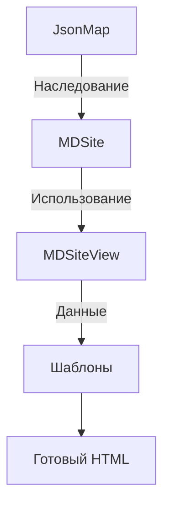

### Полная концепция системы MDSite (Markdown-сайт генератор)

#### 1. Общая архитектура системы



#### 2. Класс JsonMap (Базовый функционал)

**Назначение**: Работа с файловой системой и JSON-индексами

```php
class JsonMap {
    protected string $baseDir;
    protected array $config;
    
    public function __construct(string $baseDir, array $config = []) {
        $this->baseDir = realpath($baseDir);
        $this->config = array_merge([
            'index_file' => 'index.json',
            'dir_pattern' => '/^\d{2}_/',
            'cache_ttl' => 3600
        ], $config);
    }
    
    /**
     * Сканирует директории и создает основной индекс
     */
    public function buildFullIndex(): array {
        $index = [];
        $dirIter = new RecursiveDirectoryIterator(
            $this->baseDir,
            FilesystemIterator::SKIP_DOTS
        );
        
        foreach (new RecursiveIteratorIterator($dirIter) as $file) {
            if ($this->isValidFile($file)) {
                $index[] = $this->normalizePath($file->getPathname());
            }
        }
        
        file_put_contents(
            $this->getIndexPath(),
            json_encode($index, JSON_PRETTY_PRINT)
        );
        
        return $index;
    }
    
    protected function isValidFile(SplFileInfo $file): bool {
        // Проверка по расширению, имени и другим параметрам
    }
}
```

#### 3. Класс MDSite (Ядро системы)

**Назначение**: Обработка запросов и управление данными

```php
class MDSite extends JsonMap {
    private MDSiteView $view;
    
    public function handleRequest(array $params): array {
        return match(true) {
            // Без параметров - обновление индекса
            empty($params) => $this->buildFullIndex(),
            
            // Только dir - контент директории
            isset($params['dir']) && !isset($params['file']) => 
                $this->getDirContent($params['dir']),
                
            // Dir + file - фильтрация путей
            isset($params['dir']) && isset($params['file']) =>
                $this->filterPaths($params['dir']),
                
            default => throw new InvalidArgumentException('Invalid request')
        };
    }
    
    public function getView(): MDSiteView {
        return $this->view ??= new MDSiteView($this);
    }
    
    /**
     * Генерация превью контента
     */
    public function generatePreview(string $filePath): string {
        $content = file_get_contents($filePath);
        $extension = pathinfo($filePath, PATHINFO_EXTENSION);
        
        return match($extension) {
            'md' => $this->parseMarkdownPreview($content),
            'php' => $this->parsePhpPreview($content),
            default => $this->parseTextPreview($content)
        };
    }
}
```

#### 4. Класс MDSiteView (Представление)

**Назначение**: Подготовка данных для интерфейса

```php
class MDSiteView {
    private MDSite $site;
    private array $uiConfig;
    
    public function __construct(MDSite $site, array $config = []) {
        $this->site = $site;
        $this->uiConfig = array_merge([
            'preview_length' => 10,
            'card_types' => [
                'dir' => ['icon' => 'folder', 'color' => 'blue'],
                'md' => ['icon' => 'markdown', 'color' => 'green'],
                'php' => ['icon' => 'php', 'color' => 'purple']
            ]
        ], $config);
    }
    
    /**
     * Данные для карточек
     */
    public function getCardsData(string $dir): array {
        $items = $this->site->getDirContent($dir);
        
        return array_map(function($item) {
            return [
                'type' => $this->detectType($item),
                'title' => $this->getTitle($item),
                'preview' => $this->site->generatePreview($item),
                'url_view' => $this->generateUrl('view', $item),
                'url_content' => $this->generateUrl('content', $item),
                'meta' => $this->getMetaData($item)
            ];
        }, $items);
    }
    
    /**
     * Древовидное меню
     */
    public function getTreeMenu(): array {
        $index = $this->site->readIndex();
        $tree = [];
        
        foreach ($index as $path) {
            $parts = explode('/', trim($path, '/'));
            $current = &$tree;
            
            foreach ($parts as $part) {
                if (!isset($current[$part])) {
                    $current[$part] = [];
                }
                $current = &$current[$part];
            }
        }
        
        return $this->formatMenu($tree);
    }
}
```

#### 5. Шаблоны и рендеринг

**Интеграция с шаблонизатором**:

```php
class TemplateRenderer {
    public function render(string $template, array $data): string {
        extract($data);
        ob_start();
        include "templates/{$template}.php";
        return ob_get_clean();
    }
}

// Пример простого шаблона (templates/cards.php)
/*
<div class="card-container">
    <?php foreach ($cards as $card): ?>
        <div class="card card-<?= $card['type'] ?>">
            <h3><?= htmlspecialchars($card['title']) ?></h3>
            <div class="preview"><?= $card['preview'] ?></div>
            <a href="<?= $card['url_view'] ?>">Открыть</a>
        </div>
    <?php endforeach; ?>
</div>
*/
```

#### 6. Полный workflow обработки запроса

1. **Инициализация**:
```php
$site = new MDSite(__DIR__);
$view = $site->getView();
```

2. **Обработка запроса**:
```php
$response = $site->handleRequest($_GET);
```

3. **Рендеринг**:
```php
$templateData = [
    'menu' => $view->getTreeMenu(),
    'content' => $response,
    'breadcrumbs' => $view->getBreadcrumbs($_GET['dir'] ?? '')
];

echo (new TemplateRenderer())->render('main', $templateData);
```

#### 7. Конфигурация системы

Пример конфига:
```php
$config = [
    'base_dir' => __DIR__.'/content',
    'templates' => [
        'main' => 'layouts/main.php',
        'card' => 'components/card.php'
    ],
    'markdown' => [
        'parser' => new ParsedownExtra(),
        'options' => [...]
    ],
    'cache' => [
        'enabled' => true,
        'dir' => __DIR__.'/cache'
    ]
];
```

#### 8. Что нужно для начала разработки

1. **Создать базовую структуру**:
```
/mdsite
  /src
    JsonMap.php
    MDSite.php
    MDSiteView.php
  /templates
    main.php
    cards.php
  /content
    01_Introduction
      README.md
    02_Guide
      getting_started.md
  index.php
```

2. **Реализовать по порядку**:
- Класс JsonMap с базовыми методами работы с индексами
- Основные методы MDSite для обработки контента
- Компоненты представления в MDSiteView
- Интеграцию с шаблонами

3. **Тестовые данные**:
- Подготовить примеры markdown-файлов
- Создать несколько директорий с числовыми префиксами

Эта концепция обеспечивает четкое разделение ответственности между компонентами и позволяет гибко расширять функционал. Начинать разработку следует с базового функционала JsonMap, затем переходить к MDSite и только потом к представлению.
